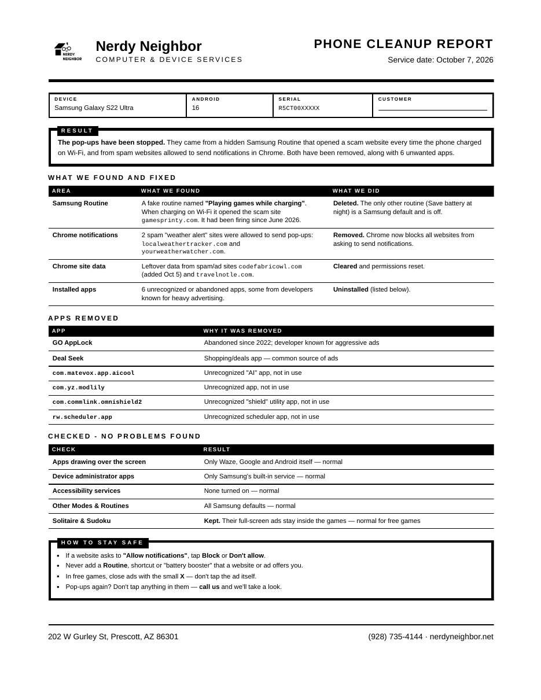

# Android Pop-up Cleanup for Claude Code and Codex

A plugin for repair shops that works in both Claude Code and OpenAI Codex. Plug in a customer's Android or Samsung Galaxy phone that's showing pop-ups, scam websites or fake virus and weather alerts. The agent finds where they're coming from, walks you through removing them, and prints a one-page report for the customer with **your shop's** name, logo and address.

Built at [Nerdy Neighbor](https://nerdyneighbor.net) in Prescott, AZ, from real customer phones.



## Why the usual "remove the bad app" approach misses it

On current Android the pop-ups usually **aren't an app at all**. The skill checks the three real sources, most common first:

1. **A hidden Samsung Routine.** A scam site adds a routine with an innocent name like "Playing games while charging" that opens a website whenever the phone charges. There's no app to uninstall, and antivirus apps don't see it.
2. **Chrome site notifications.** Fake "weather alert", "package delivery" or "virus found" sites that the customer once tapped **Allow** on.
3. **Apps.** Apps that draw over other apps, or abuse device admin or accessibility, plus junk "cleaner" and "booster" apps.

Everything starts **read-only**. Nothing is uninstalled until you approve it, and the agent asks which apps the customer actually uses. Free games that show ads *inside* the game are left alone.

## What you need

- **An AI coding agent:** either
  - **Claude Code** with a paid Claude plan (Pro or Max) or an API key: <https://claude.com/claude-code>, or
  - **OpenAI Codex CLI** with a ChatGPT plan (Plus, Pro, Business) or an API key: <https://github.com/openai/codex>
- **Python 3**
- **Android platform-tools (adb)**
- **Google Chrome, Microsoft Edge or Chromium**, used to print the PDF report
- A USB **data** cable. Many cheap cables are charge-only.

## Setup

### Windows
Open PowerShell and run:
```powershell
winget install Python.Python.3.12
winget install Google.PlatformTools
winget install Git.Git
```
Edge is already installed, so you don't need Chrome. Then install the agent you want:
```powershell
irm https://claude.ai/install.ps1 | iex                                                # Claude Code
powershell -ExecutionPolicy ByPass -c "irm https://chatgpt.com/codex/install.ps1 | iex"  # Codex
```

### macOS
```bash
brew install python android-platform-tools
```
No Homebrew? Get it at <https://brew.sh>. Then install the agent you want:
```bash
curl -fsSL https://claude.ai/install.sh | bash   # Claude Code
brew install --cask codex                        # Codex
```

### Linux
Install Python, adb (with its USB permission rules) and a browser for your distro:

| Distro | Command |
|---|---|
| Ubuntu, Debian, Mint, Pop!_OS | `sudo apt install python3 adb` and Google Chrome from <https://google.com/chrome> |
| Fedora | `sudo dnf install python3 android-tools chromium` |
| Arch, Manjaro, CachyOS, EndeavourOS | `sudo pacman -S python android-tools android-udev chromium`, then `sudo usermod -aG adbusers $USER` and log out and back in |
| openSUSE | `sudo zypper install python3 android-tools chromium` |

On Ubuntu, use the Chrome `.deb` rather than the Chromium snap. The snap's sandbox can get in the way of printing the report.

Then install the agent you want:
```bash
curl -fsSL https://claude.ai/install.sh | bash   # Claude Code
npm install -g @openai/codex                     # Codex (needs Node.js)
```

If `adb devices` shows `no permissions`, the USB rules aren't active yet. Unplug the phone, plug it back in, and try again. On Arch-based distros, also check that you logged out after joining `adbusers`.

## Install the plugin

### Claude Code
Start `claude` in a terminal, then type:
```
/plugin marketplace add nerd-industries/android-cleanup
/plugin install android-cleanup@android-cleanup
```
Restart Claude Code. To update later, run `/plugin marketplace update android-cleanup`.

### Codex
In a terminal:
```bash
codex plugin marketplace add nerd-industries/android-cleanup
codex plugin add android-cleanup@android-cleanup
```
To update later, run `codex plugin marketplace upgrade android-cleanup`.

**Codex needs one setting.** Codex's sandbox blocks network connections by default, and adb talks to its own background service over a local connection. Without this setting, every adb command fails with `cannot connect to daemon`. Add these lines to `~/.codex/config.toml` (on Windows, `%USERPROFILE%\.codex\config.toml`):
```toml
[sandbox_workspace_write]
network_access = true
```
Before starting Codex, also run `adb start-server` once, so adb's background service runs outside the sandbox and can reach the USB port. The first time Codex saves your shop details, it asks permission to write outside the job folder. Approve it.

## Using it

1. **On the phone:** Settings → About phone → Software information → tap **Build number** 7 times. Then go to Settings → Developer options → turn on **USB debugging**.
2. Plug the phone in and tap **Allow** on the "Allow USB debugging?" prompt.
3. Make a folder for the job (for example `Documents/Cleanups/Smith`), start `claude` or `codex` in it, and describe the problem:
   > Customer's Galaxy is plugged in. Pop-ups and a scam website keep opening by themselves, mostly when it's charging.
4. The agent runs the checks, shows you what it found, and asks before removing anything. Some steps happen on the phone's screen (Samsung doesn't allow reading Routines over USB), so keep the phone unlocked.
5. When it's done, ask for **the cleanup report**. The first time, it asks for your shop name, address, phone, website and logo, and saves them to `~/.android-cleanup/` so you're only asked once.
6. Turn USB debugging back off before the customer leaves.

## Privacy

Everything runs on your computer and the phone. The plugin itself sends nothing anywhere. Your agent sends what it reads (app lists, website names, screenshots of the phone's settings screens) to Anthropic (Claude Code) or OpenAI (Codex) to work on it, the same as any other session. Tell your customer, and don't use it on phones you're not authorized to service.

## License

MIT. Use it, change it, share it. No warranty: you're responsible for what's changed on a customer's phone.
